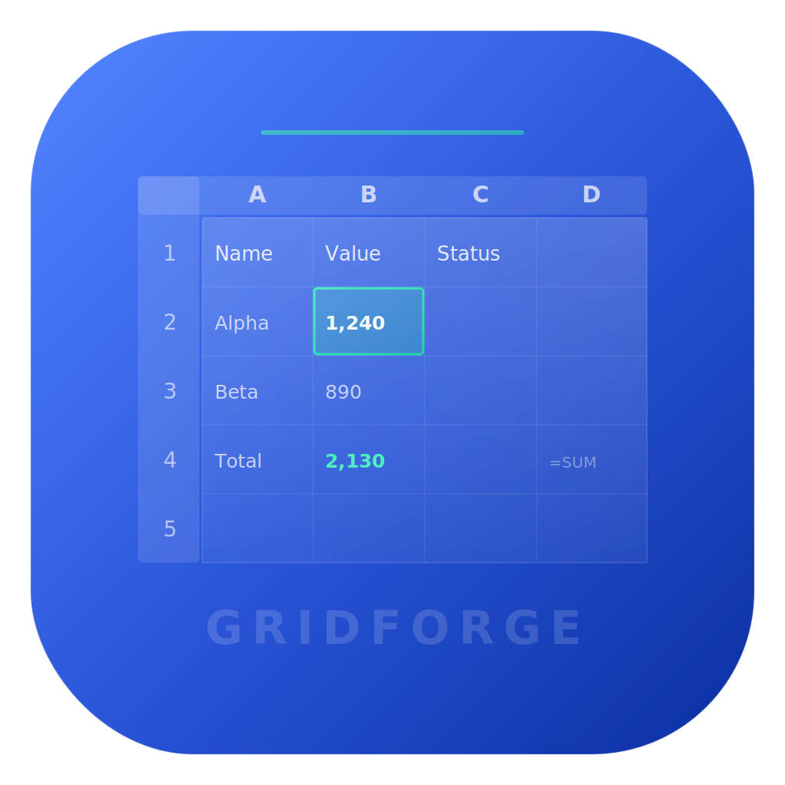

<p align="center">
  
</p>

<h1 align="center">GridForge</h1>

<p align="center">
  <strong>Next-Generation Native macOS Spreadsheet Engine</strong><br/>
  <em>Real formula engine, XLSX import/export, premium UI. Built with Swift + SwiftUI.</em>
</p>

<p align="center">
  <a href="https://github.com/Worth-Doing/GridForge/releases/latest"></a>
</p>

<p align="center">
  
  
  
  
  
  
</p>

<p align="center">
  
  
  
  
  
</p>

<p align="center">
  
  
  
  
  
</p>

<p align="center">
  
  
  
  
  
</p>

---

## What is GridForge?

GridForge is a **serious, native macOS spreadsheet application** built from scratch in Swift + SwiftUI — without Xcode. It features a real formula engine with 50+ functions, genuine XLSX import/export compatible with Excel, a high-performance virtualized grid, and a premium modern UI.

This is not a demo or prototype. GridForge is a **production-grade spreadsheet foundation** with:

- A complete **tokenizer + recursive descent parser + AST evaluator** formula engine
- Real **OpenXML (.xlsx) reader/writer** with roundtrip fidelity
- A **virtualized grid renderer** using Core Graphics with cached offsets and binary search
- Full **dark mode support** with adaptive system colors
- **Command-pattern undo/redo** with batch operations
- Apple **Developer ID signed and notarized** for Gatekeeper-clean distribution

---

## Download

| Artifact | Size | Details |
|----------|------|---------|
| [**GridForge.dmg**](https://github.com/Worth-Doing/GridForge/releases/latest) | 2.4 MB | Signed & Notarized. Drag to Applications. |

> Requires **macOS 14 (Sonoma)** or later. Universal binary (Apple Silicon + Intel).

---

## Feature Matrix

### Spreadsheet Core

| Feature | Status | Details |
|---------|--------|---------|
| Multi-sheet workbooks | Done | Add, delete, rename, duplicate, reorder |
| Cell editing | Done | Inline + formula bar editing |
| Formula engine | Done | 50+ functions, recursive descent parser, dependency graph |
| Cell references | Done | A1-style, absolute ($A$1), cross-cell |
| Range references | Done | A1:B10 ranges in formulas |
| Dependency tracking | Done | Directed graph with topological sort |
| Circular reference detection | Done | Cycle detection with #CIRCULAR! error |
| Recalculation engine | Done | Full + incremental (affected cells only) |
| XLSX import | Done | OpenXML reader via ZIPFoundation |
| XLSX export | Done | Excel-compatible output |
| CSV export | Done | With proper escaping |
| Undo / Redo | Done | Command pattern, batch support |
| Copy / Cut / Paste | Done | Tab-separated, multi-cell, clipboard |
| Row/Column insert/delete | Done | With undo support |
| Column resize | Done | Drag column header borders |
| Selection | Done | Single, range, shift-extend, keyboard |
| Keyboard navigation | Done | Arrows, Tab, Enter, Home, End, Page Up/Down |

### Formula Functions (50+)

| Category | Functions |
|----------|-----------|
| **Math** | SUM, AVERAGE, MIN, MAX, COUNT, COUNTA, ABS, ROUND, INT, MOD, POWER, SQRT, CEILING, FLOOR, LOG, LN, EXP, TRUNC |
| **Logical** | IF, AND, OR, NOT, IFERROR, IFNA |
| **Lookup** | VLOOKUP, INDEX, MATCH |
| **Conditional** | SUMIF, COUNTIF |
| **Text** | LEN, LEFT, RIGHT, MID, UPPER, LOWER, TRIM, CONCATENATE, FIND, SUBSTITUTE, TEXT |
| **Info** | ISBLANK, ISNUMBER, ISTEXT, ISERROR, TYPE |
| **Date** | TODAY, NOW |
| **Operators** | `+` `-` `*` `/` `^` `%` `&` `=` `<>` `<` `>` `<=` `>=` |

### UI & UX

| Feature | Status | Details |
|---------|--------|---------|
| Native macOS UI | Done | SwiftUI + AppKit hybrid |
| Dark mode | Done | Full adaptive colors via system semantics |
| Formula bar | Done | Name box + formula editor |
| Sheet tabs | Done | Capsule tabs, context menu, hover states |
| Side inspector | Done | Cell info, formatting, sheet stats |
| Status bar | Done | Selection stats (Sum, Average, Count) |
| Toolbar | Done | File, Format, Edit, View actions |
| Context menu | Done | Right-click Cut/Copy/Paste, Insert/Delete |
| Hover feedback | Done | Cell + header highlighting |
| Column resize | Done | Drag header borders |
| Error banner | Done | Auto-dismiss error notifications |
| Dirty tracking | Done | Window title shows unsaved state |
| Open/Save panels | Done | Native macOS panels, unsaved changes warning |

### Keyboard Shortcuts

| Shortcut | Action |
|----------|--------|
| `Cmd+N` | New workbook |
| `Cmd+O` | Open XLSX |
| `Cmd+S` | Save |
| `Cmd+Shift+S` | Save As |
| `Cmd+Shift+E` | Export CSV |
| `Cmd+Z` | Undo |
| `Cmd+Shift+Z` | Redo |
| `Cmd+X/C/V` | Cut / Copy / Paste |
| `Cmd+A` | Select all |
| `Cmd+B/I/U` | Bold / Italic / Underline |
| `Cmd+=/-/0` | Zoom in / out / reset |
| `F2` | Edit cell |
| `Enter` | Commit + move down |
| `Tab` | Commit + move right |
| `Escape` | Cancel edit |
| `Delete` | Clear cell(s) |
| `Arrow keys` | Navigate |
| `Shift+Arrow` | Extend selection |
| `Page Up/Down` | Scroll viewport |
| `Home/End` | First / last column |
| `Cmd+Home` | Go to A1 |

---

## Architecture

GridForge is built as **5 decoupled engines**:

```
┌─────────────────────────────────────────────────┐
│                   GridForge.app                  │
│  ┌─────────────────────────────────────────────┐ │
│  │              UI Layer (SwiftUI)              │ │
│  │  Toolbar │ FormulaBar │ Grid │ Tabs │ Inspector │
│  └──────────────────┬──────────────────────────┘ │
│  ┌──────────────────┴──────────────────────────┐ │
│  │           WorkbookViewModel                  │ │
│  │    State coordination + command dispatch     │ │
│  └──────┬────────┬────────┬────────┬───────────┘ │
│  ┌──────┴──┐ ┌───┴───┐ ┌──┴──┐ ┌──┴──┐ ┌──────┐ │
│  │Workbook │ │Formula│ │XLSX │ │Undo │ │Select│ │
│  │ Engine  │ │Engine │ │R/W  │ │Redo │ │Model │ │
│  └─────────┘ └───────┘ └─────┘ └─────┘ └──────┘ │
└─────────────────────────────────────────────────┘
```

### Module Breakdown

| Module | Path | LOC | Purpose |
|--------|------|-----|---------|
| **Workbook** | `Sources/GridForgeCore/Workbook/` | 675 | Data model: Cell, Worksheet, Workbook, CellAddress, CellValue |
| **Formula Engine** | `Sources/GridForgeCore/FormulaEngine/` | 2,167 | Tokenizer, Parser, AST, Evaluator, DependencyGraph |
| **XLSX Engine** | `Sources/GridForgeCore/ImportExport/` | 802 | OpenXML reader/writer via ZIPFoundation |
| **Infrastructure** | `Sources/GridForgeCore/{Selection,UndoRedo,Grid}/` | 624 | Selection state, command-pattern undo, viewport model |
| **UI** | `Sources/GridForge/` | 2,644 | Grid renderer, formula bar, tabs, inspector, theme |
| **Tests** | `Tests/GridForgeTests/` | 721 | Model, formula, XLSX roundtrip tests |

### Formula Engine Internals

```
Input: "=SUM(A1:A10)*2+1"
         │
    ┌────▼────┐
    │Tokenizer│  → [FUNC("SUM"), LPAREN, REF("A1"), COLON, REF("A10"), RPAREN, MULT, NUM(2), PLUS, NUM(1)]
    └────┬────┘
    ┌────▼────┐
    │ Parser  │  → BinaryOp(+, BinaryOp(*, FunctionCall("SUM", [Range(A1,A10)]), Num(2)), Num(1))
    └────┬────┘
    ┌────▼─────┐
    │Evaluator │  → Resolve refs → Evaluate AST → .number(result)
    └────┬─────┘
    ┌────▼──────────┐
    │DependencyGraph│  → Track A1→A10 precedents, trigger recalc on change
    └───────────────┘
```

### Grid Rendering Pipeline

The grid uses **NSView + Core Graphics** (not SwiftUI views) for performance:

- **Cached cumulative offsets**: O(1) position lookups via precomputed arrays
- **Binary search**: O(log n) hit-testing for column/row at point
- **Batched drawing**: All vertical lines in one stroke, then all horizontal
- **Cached font attributes**: 4 font variants (normal, bold, italic, bold+italic) created once
- **Dirty rect clipping**: Only redraws the invalidated region

---

## Build from Source

```bash
# Clone
git clone https://github.com/Worth-Doing/GridForge.git
cd GridForge

# Build (release + app bundle)
./build.sh build

# Run
open GridForge.app

# Run tests
./build.sh test

# Create signed DMG
./build.sh dmg

# Notarize with Apple
./build.sh notarize
```

### Requirements

- macOS 14+
- Swift 5.9+
- **No Xcode project required** — built entirely with Swift Package Manager

### Build Commands

| Command | Description |
|---------|-------------|
| `./build.sh build` | Release build + .app bundle with icon |
| `./build.sh run` | Debug build + launch |
| `./build.sh test` | Run 64 unit tests |
| `./build.sh dmg` | Build + code sign + create DMG |
| `./build.sh notarize` | Submit to Apple notarization + staple |
| `./build.sh clean` | Remove all build artifacts |

---

## Project Structure

```
GridForge/
├── Package.swift
├── build.sh
├── Assets/
│   ├── GridForge-Logo.svg
│   └── GridForge.icns
├── Sources/
│   ├── GridForgeCore/           # Core engine library
│   │   ├── Workbook/            # Cell, Worksheet, Workbook models
│   │   ├── FormulaEngine/       # Tokenizer, Parser, Evaluator, DependencyGraph
│   │   ├── ImportExport/        # XLSX Reader & Writer
│   │   ├── Selection/           # Selection state machine
│   │   ├── UndoRedo/            # Command-pattern undo/redo
│   │   └── Grid/                # Viewport model
│   └── GridForge/               # App + UI
│       ├── App/                 # @main entry, menus
│       ├── DesignSystem/        # Colors, typography, spacing, animations
│       ├── Features/            # ViewModel, window layout
│       └── UI/                  # GridView, FormulaBar, SheetTabs, Inspector
└── Tests/
    └── GridForgeTests/          # Model, Formula, XLSX tests
```

---

## Testing

```
64 tests, 0 failures

FormulaTests (30):   Arithmetic, precedence, cell refs, functions, comparisons, recalculation, dependency graph
ModelTests (22):     CellAddress parsing, ranges, worksheet CRUD, workbook management, selection
XLSXTests (12):      Export, roundtrip strings/numbers/booleans/formulas/special chars, large sheets
```

---

## Tech Stack

| Component | Technology |
|-----------|------------|
| Language | Swift 5.9+ |
| UI Framework | SwiftUI + AppKit (NSViewRepresentable) |
| Grid Rendering | Core Graphics (NSView + CGContext) |
| Build System | Swift Package Manager (CLI) |
| XLSX Parser | ZIPFoundation + Foundation XMLParser |
| Formula Engine | Custom tokenizer + recursive descent parser |
| Architecture | MVVM + Command Pattern |
| Code Signing | Developer ID Application |
| Notarization | Apple Notary Service |

---

## Roadmap

### V2 — Power Features
- Cell formatting in XLSX export (colors, bold, borders)
- Frozen panes (freeze top rows / left columns)
- Advanced filtering & sorting UI
- Conditional formatting rules
- Column/row auto-fit
- 100+ additional formula functions

### V3 — Advanced System
- Charts & data visualization
- Pivot tables
- Scripting layer
- Plugin system
- External data source connectors

---

## License

MIT License. See [LICENSE](LICENSE) for details.

---

<p align="center">
  <sub>Built with Swift + SwiftUI by <a href="https://github.com/Worth-Doing">WorthDoing AI</a></sub>
</p>
